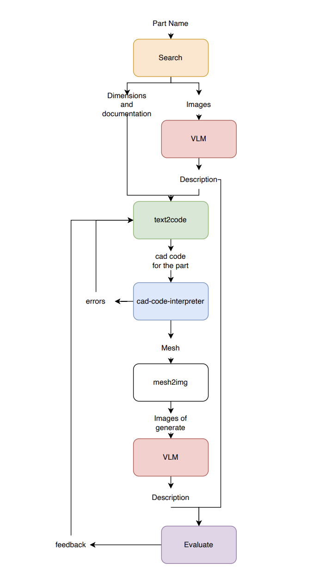

Current product (v0) - part name to cad.

Idea: a lot of time is spent cadding existing parts either from description or from physical form. What if instead any part you see, or any part you find online, could have its mechanical representation without you having to do all the measurements?

1. Search2CAD Use LLM with search (cohere API, or perplexity API) to get documentation for the part. we are looking for detailed dimensions and a lot of pictures. summarize stuff important for the task of cadding the part

Picture2dscripont: use VLMs through API to give a detailed description fo the images of an object so they can later be combined to cad

Generate querycad/openscad code: combine all the context we now have of the part and generate cad code for the part. this will be done using the most frontier model, o1 or whatever
querycad/openscad to mesh - get a mesh using querycad or openscad
mesh to image: take pictures of the mesh from many anglers (screenshots)
picture2description: get description of the part from many nagles
compare and evaluate: compare if the descriptions look similar. If yes, then parts are similar. if no, parts are different. Differences tell to 3 and repeat up to 7 until satisfied

